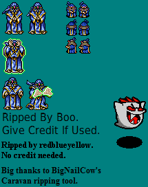

# Brother Monk

## Team Members:
* Christian Phillips,
* Baldwin Suen,
* Andres Santamaria

## Abstract:
Help Brother Monk fight his way through the Labyrinth in search of his friends. As Brother Monk saves his fellow monks, they will bless him with upgrades to his unique Orb powers. Use the Orbs and your wit to free your companions and defeat monsters!

## Game Inspiration

### The Binding of Isaac

        
  Our player character, Brother Monk, moves around a 2D level similarly to Isaac in *The Binding of Isaac*.
        

### Hotline Miami

        
  The game has a top down 2D perspective, and relies on the user's mouse input to aim Brother Monk's Orbs at enemies.
        

### Enter the Gungeon

        
  Enter the Gungeon spawns waves of enemies to attack the player when they enter new rooms. Similarly, Brother Monk will encounter waves of enemies as he enter new rooms, or 'levels'.
        

  

## Controls:
TODO:  
* arrow keys or WSAD for movement
* keys to cycle Orb modes (Attack, Defend, Recall, Explore)
* mouse to control Orb movement: click to direct orbs to a location, drag to have orbs follow a path.
* 'p' to pause/restart game
* 'esc' to quit (allows save first)

## Installation and Setup:
TODO:

## Resources:

* acquired sprite sheets from Spriters-Resource.com uploaded by users CrimsonPenguin ...
* this list will be updated as new sprite assets are used / created
